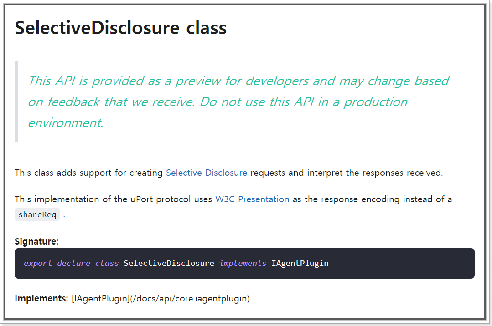

# `Serto(구 UPort)`

<br><br>

<hr>

<br><br>

# uPort is now Serto

The uPort project set forth at ConsenSys in 2015 to explore a new form of identity where end-users and enterprises could become active stewards of their verifiable data. This initiative evolved into a variety of experiments, enabling end-users to hold their identity credentials in mobile wallets, helping people use those credentials to accomplish real-world actions and impacting communities on a global scale with these new approaches.

uPort’s leading-edge experiments paved the way for the W3C’s decentralized identity (DID) and verifiable credential (VC) standards; these primitives offer a new common global approach to identity and reputation.
Today, Serto continues this critical work with a refined set of tools and a focus on usability and enterprise implementation of DIDs and VCs.
We are joined by alumni of Alpine (a crypto-economics team engineering value with new enterprise transactions) and Civil (a blockchain-based platform for trustworthy journalism), among others, and continue to be part of The Mesh.

We have observed that the root problem with nearly every decentralized ecosystem is the absence of a decentralized identity solution, which necessarily leads to a re-centralization — and renders blockchains like Ethereum more superfluous technical complexity than truly enabling infrastructure.

The Serto team envisions a world where identities of any sort can use decentralized standardized identity and verifiable data solutions (starting with DIDs and VCs) to exchange data in a trusted, private and scalable way without unnecessary intermediaries.

Our mission is to catalyze adoption of decentralized technologies by resolving the critical identity blocker — the friction of using decentralized identity technology.
We combat this friction by making it easier for everyone to use DIDs and VCs.

Learn more about our current work and our products at Serto.ID

 - `UPORT LIBRARY SUPPORT`

Please be advised that ongoing support for all uPort libraries will be deprecated May 1, 2021. These resources will be available for free, unsupported download until December 30, 2021. Please direct any questions about the uPort libraries to Gregory.Bugyis at mesh dot xyz.

<br><br><br><br><br>

<hr>

<br><br><br><br><br>

# Serto 개요

ConsenSys가 2015년부터 uPort Project를 셋팅하였다. 이는 실험적인 단계였으며 이제는 그 명맥을 Serto가 이어나간다.

현재 Serto는 다음과 같이 프레임워크 및 오픈소스를 만들거나 참여하였다.

###### Framework

 - `Veramo Framework` : JavaScript 기반의 SSI 시스템을 편하게 사용할 수 있게 하는 개발 프레임워크이다.

     - [website](https://veramo.io/)
     - [github](https://github.com/uport-project/veramo)

<br><br>

###### Featured Open Source Projects

|이름|설명|링크|
|:---:|:---:|:---:|
|`ether-did`|A scalable DID method for Ethereum addresses enabling them to collect on-chain and off-chain data.|[github](https://github.com/uport-project/ethr-did)|
|`ether-did-registry`|Ethereum registry for ERC-1056 ethr-did methods|[github](https://github.com/uport-project/ethr-did-registry)|
|`ether-status-registry`|Verifiable Credential status resolver using an ethereum contract as a backend|[github](https://github.com/uport-project/ethr-status-registry)|

<br><br>

###### Featured Open Source Projects


|이름|설명|링크|
|:---:|:---:|:---:|
|`did-resolver`|Universal did-resolver for javascript environments|[github](https://github.com/decentralized-identity/did-resolver)|
|`did-jwt`|Create and verify DID verifiable JWT's in Javascript|[github](https://github.com/decentralized-identity/did-jwt)|
|`ether-did-resolver`|DID resolver for Ethereum Addresses with support for key management|[github](https://github.com/decentralized-identity/ethr-did-resolver)|
|`web-did-resolver`|Create and verify DID compliant JWT’s in Javascript|[github](https://github.com/decentralized-identity/web-did-resolver)|
|`did-jwc-vc`|Create and verify W3C Verifiable Credentials and Presentations in JWT format|[github](https://github.com/decentralized-identity/did-jwt-vc)|

<br><br><br><br><br>

<hr>

<br><br><br><br><br>

# Veramo Framework 소개

`Veramo는 Typescript를 사용하여 구현되었다.`

[reference website](https://veramo.io/docs/veramo_agent/introduction/)

<br><br><br>

## - Veramo Core `@veramo/core`


```
Agent implements IAgent
```
[API reference](https://veramo.io/docs/api/core.agent/)

Provides Agent implementation and defines plugin interfaces
 - IKeyManager
 - IDataStore
 - IDIDManager
 - IResolver
 - IMessageHandler


<br><br><br>

## - plugins


### * Core Plugins

 - `@veramo/did-manager`
 - `@veramo/did-provider-ethr`
 - `@veramo/did-provider-web`
 - `@veramo/did-provider-key`
 - `@veramo/key-manager`
 - `@veramo/kms-local`
 - `@veramo/did-resolver`
 - `@veramo/did-comm`
 - `@veramo/did-jwt`
 - `@veramo/message-handler`
 - `@veramo/url-handler`
 - `@veramo/selective-disclosure`
 - `@veramo/credential-w3c`
 - `@veramo/remote-server`
 - `@veramo/data-store`
 - `@veramo/remote-client`

### * 특이사항

현재 완벽하게 구현된건 아니다. 아래는 `@veramo/selective-disclosure` 패키지 구성중의 SelectiveDisclosure 클래스에 관한 내용이다.



<br><br><br><br><br>

<hr>

<br><br><br><br><br>

# Veramo Framework Simple Example

## - Prerequisite
### * node 설치와 yarn 설치 필요

node.js 설치 후 yarn 설치는 아래와 같이

```cmd
npm install -g yarn
```

### * infura 계정 생성 및 프로젝트 생성(Ethereum) 필요

https://infura.io/

### * 프로젝트 셋팅

#### step 01. create directory

```cmd
mkdir veramo-agent && cd veramo-agent
yarn init -y
```

#### step 02. yarn add

```cmd
yarn add typescript ts-node --dev
```

#### step 03. install veramo plugins

```cmd
yarn add @veramo/core @veramo/credential-w3c @veramo/data-store @veramo/did-manager @veramo/did-provider-ethr @veramo/did-provider-web @veramo/did-resolver @veramo/key-manager @veramo/kms-local ethr-did-resolver web-did-resolver
```

#### step 04. install sqlite

```cmd
yarn add sqlite3
```


#### step 05. tsconfig.json

###### `veramo-agent/tsconfig.json`

```
{
  "compilerOptions": {
    "preserveConstEnums": true,
    "strict": true,
    "target": "es6",
    "rootDir": "./",
    "moduleResolution": "node",
    "esModuleInterop": true,
    "downlevelIteration": true
  }
}
```

### * `.env` 파일 필요

###### `veramo-agent/.env`

```cmd
INFURA_PROJECT_ID=이곳에 당신의 프로젝트 입력 ID, 쌍따옴표 같은 것은 필요없음
```

### * npm install

```js
npm install
```

<br><br><br>

## - Implementation

###### `/`

##### .env

```
INFURA_PROJECT_ID=이곳에 당신의 프로젝트 입력 ID, 쌍따옴표 같은 것은 필요없음
```

<br><br>

###### `veramo-agent/src/veramo/setup.ts`

```ts
// Core interfaces
import { createAgent, IDIDManager, IResolver, IDataStore, IKeyManager } from '@veramo/core'

// Core identity manager plugin
import { DIDManager } from '@veramo/did-manager'

// Ethr did identity provider
import { EthrDIDProvider } from '@veramo/did-provider-ethr'

// Web did identity provider
import { WebDIDProvider } from '@veramo/did-provider-web'

// Core key manager plugin
import { KeyManager, AbstractSecretBox } from '@veramo/key-manager'

// Custom key management system for RN
import { KeyManagementSystem } from '@veramo/kms-local'

// Custom resolvers
import { DIDResolverPlugin } from '@veramo/did-resolver'
import { Resolver } from 'did-resolver'
import { getResolver as ethrDidResolver } from 'ethr-did-resolver'
import { getResolver as webDidResolver } from 'web-did-resolver'

// Storage plugin using TypeOrm
import { Entities, KeyStore, DIDStore, IDataStoreORM } from '@veramo/data-store'

// TypeORM is installed with `@veramo/data-store`
import { createConnection } from 'typeorm'

import { CredentialIssuer, ICredentialIssuer } from '@veramo/credential-w3c'

// 프로젝트 ID 보호
import path from 'path'
import dotenv from 'dotenv'
import { resolve } from 'path/posix'


dotenv.config({ path: path.join(__dirname, '../../.env') })

// This will be the name for the local sqlite database for demo purposes
const DATABASE_FILE = 'database.sqlite'

// You will need to get a project ID from infura https://www.infura.io
const INFURA_PROJECT_ID = process.env.INFURA_PROJECT_ID

const dbConnection = createConnection({
  type: 'sqlite',
  database: DATABASE_FILE,
  synchronize: true,
  logging: ['error', 'info', 'warn'],
  entities: Entities,
})

class SecretBox extends AbstractSecretBox{
  encrypt(message: string): Promise<string> {
    throw new Error('Method not implemented.')
  }
  decrypt(encryptedMessageHex: string): Promise<string> {
    throw new Error('Method not implemented.')
  }
}


export const agent = createAgent<IDIDManager & IKeyManager & IDataStore & IDataStoreORM & IResolver & ICredentialIssuer>({
  plugins: [
    new KeyManager({
      //Please provide SecretBox to the KeyStore
      //--> store: new KeyStore(dbConnection,new SecretBox())
      store: new KeyStore(dbConnection),
      kms: {
        local: new KeyManagementSystem(),
      },
    }),
    new DIDManager({
      store: new DIDStore(dbConnection),
      defaultProvider: 'did:ethr:rinkeby',
      providers: {
        'did:ethr:rinkeby': new EthrDIDProvider({
          defaultKms: 'local',
          network: 'rinkeby',
          rpcUrl: 'https://rinkeby.infura.io/v3/' + INFURA_PROJECT_ID,
        }),
        'did:web': new WebDIDProvider({
          defaultKms: 'local',
        }),
      },
    }),
    new DIDResolverPlugin({
      resolver: new Resolver({
        ...ethrDidResolver({ infuraProjectId: INFURA_PROJECT_ID }),
        ...webDidResolver(),
      }),
    }),
    new CredentialIssuer(),
  ],
})
```

<br><br>

###### `veramo-agent/src/create-identifier.ts`

```ts
import { agent } from './veramo/setup'

async function main() {
  const identity = await agent.didManagerCreate()
  console.log(`New identity created`)
  console.log(identity)
}

main().catch(console.log)
```

<br><br>

###### `veramo-agent/src/create-identifier.ts`

```ts
import { agent } from './veramo/setup'

async function main() {
  const identity = await agent.didManagerCreate()
  console.log(`New identity created`)
  console.log(identity)
}

main().catch(console.log)
```

<br><br>

###### `veramo-agent/src/resolver.ts`

```ts
import { agent } from './veramo/setup'

async function main() {

  //didUrl 상황에 맞게 수정 필요
  const doc = await agent.resolveDid({
    didUrl: 'did:ethr:rinkeby:0x03b6ffaacae6661b57b612083c17efeadc0cd42402b7c21fab0fbd3519a3403b50',
  });

  console.log(doc);
}

main().catch(console.log)
```

<br><br>

###### `veramo-agent/src/create-credential.ts`

```ts
import { agent } from './veramo/setup'

async function main() {
  const verifiableCredential = await agent.createVerifiableCredential({
      credential: {
          issuer : {id : 'did:ethr:rinkeby:0x03ba1cf1fa7ebb6ea862ee2104423d3aa790e59e4d61dd487ea088108fca1a5dfa'},
          credentialSubject: {
              name : 'alice',
              gender: 'male',
              age: 25
          }
      },
      proofFormat: 'jwt',
      save: false
  })

  console.log("=============== VC ===============") 
  console.log(verifiableCredential);

  const verifiablePresentation = await agent.createVerifiablePresentation({
      presentation:{
        // id?: string | undefined;
        holder: 'did:ethr:rinkeby:0x020bcc200adf42b4652aafdcf935817821c073f5e48000482abf0fe53304bd2f1f',
        // issuanceDate?: string | undefined;
        // expirationDate?: string | undefined;
        // '@context'?: string[] | undefined;
        // type?: string[] | undefined;
        verifier: ["UPORT Corp."],
        verifiableCredential: [verifiableCredential]
      },
      proofFormat: 'jwt',
      save: false
  })

  console.log("=============== VP ===============") 
  console.log(verifiablePresentation);
}

main().catch(console.log)
```


## - Test

### * `package.json`에 다음 내용 추가

```js
{
  "scripts": {
    "id:list": "ts-node ./src/list-identifiers",
    "id:create": "ts-node ./src/create-identifier",
    "id:resolve": "ts-node ./src/resolver",
    "vc:create": "ts-node ./src/create-credential"
  }
}
```

<br><br><br>

### * yarn을 이용해 각 스크립트 실행

```cmd
yarn id:list
```

```cmd
yarn id:create
```

```cmd
yarn id:resolve
```

```cmd
yarn vc:create
```