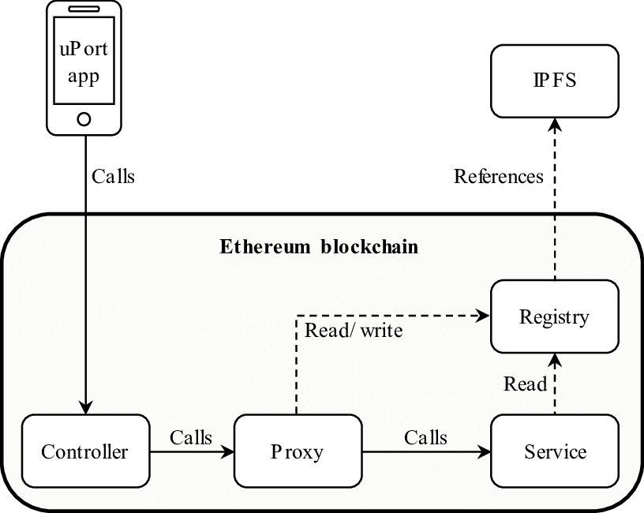

# UPort

Helping You Build User Centric Apps on Blockchains

 - uPort Project
https://developer.uport.me/overview/index

https://developer.uport.me/

 - uPort Specs

https://github.com/uport-project/specs

https://developer.uport.me/categories/specs

 - uPort Connect

[Guide](https://developer.uport.me/uport-connect/guides/usage)

https://developer.uport.me/categories/uport-connect

 - uPort Credentials

[Guide](https://developer.uport.me/uport-credentials/guides/tutorial)

https://github.com/uport-project/uport-credentials

https://developer.uport.me/categories/uport-credentials

 - uPort Transports

[Guide](https://developer.uport.me/uport-transports/guides/modules)

https://developer.uport.me/categories/uport-transports
 - uPort Registry (DEPRECATED)

https://github.com/uport-project/uport-registry

 - Ethereum DID

https://github.com/uport-project/ethr-did

 - Ethereum DID Registry

https://github.com/uport-project/ethr-did-registry

 - uPort Whitepaper

https://blockchainlab.com/pdf/uPort_whitepaper_DRAFT20161020.pdf

     

     

# 01.

     

     

# QA

## - IPFS란?
 - DHT (Routing)
 - BitTorrent (File Exchanging)
 - Git (Merkle DAG) : content-addressed : 컨텐츠 자체가 주소
 - BitSwap Protocol
 - IPNS

## ngrok